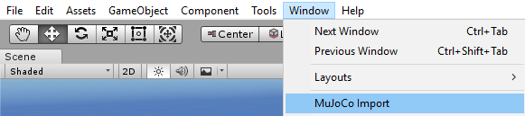
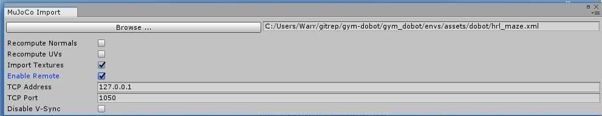
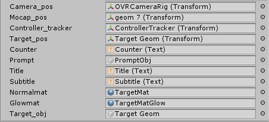

# Extending to New Environments
The steps to extend DobotVR to new [gym-dobot](https://github.com/WarrG3X/gym-dobot) environments is outlined below.

## 1) Clone Repos
Clone this repo and also [gym-dobot](https://github.com/WarrG3X/gym-dobot).

## 2) XML Cleanup
DobotVR makes use of Mujoco Unity Plugin to parse a MJCF(XML) file. These files are located [here](https://github.com/WarrG3X/gym-dobot/tree/master/gym_dobot/envs/assets/dobot). Now all environments refer to a common file [base.xml](https://github.com/WarrG3X/gym-dobot/blob/master/gym_dobot/envs/assets/dobot/base.xml) and [robot_pick.xml](https://github.com/WarrG3X/gym-dobot/blob/master/gym_dobot/envs/assets/dobot/robot_pick.xml). 

1) Comment all geoms with the name "mark" in base.xml. These are unnecessary geoms that will clutter the Unity Scene.
2) Ensure that the first 4 geoms in robot_pick.xml are uncommented. These are the Mocap objects, and thus will be referred to by the Unity objects. Also set the alpha of each of these mocap objects to somewhere between 0.3-0.4 to make them visible. *Note - alpha is the fourth value of the rgba attribute*

## 3) Initial Setup
In Unity, open the DobotVR project. In *Scenes* folder, open the *SampleScene*. This is the default scene for the DobotClutterPickAndPlaceEnv. In the scene hierarchy, there will be a single MuJoCo object, which is created by the Mujoco Unity Plugin. At any instance, there can only be a single MuJoCo object, so we will have to create a new scene, for a different environment. So select the *SampleScene* in the *Assets* folder and press *Ctrl+D* to duplicate the scene object. Open this new scene as this will be the working environment.

## 4) Import Mujoco Env
In the top bar, select *Window -> MuJoCo Import*. This should open a new editor window.
|  | 
|:--:| 
Now in this editor window, browse to the MJCF/XML File in the gym-dobot folder. In this case, we will be trying the HRLMazeEnv so browse and select [hrl_maze.xml](https://github.com/WarrG3X/gym-dobot/blob/master/gym_dobot/envs/assets/dobot/hrl_maze.xml). Now make sure to tick the *Enable Remote* option. The TCP address,port can be left at default values. Finally press *Import Model*.

|  | 
|:--:| 
| *Mujoco Editor Window* |

Now this will create a new Mujoco object. But other things, such as camera,text will also be affected so now a few things need to be modified.

## 5) Scaling
Select the *MuJoCo* object in the scene hierarchy, and in the Transform, set the Scale to *10,10,10*. This is important as the default object size is too small, and the oculus controller mapping, takes this scale into account.

## 6) Remove Unnecessary Geoms
Expand the *MuJoCo* object. There should be around 20-30 objects under it. Now disable the *Mesh Renderer* for the following objects - 
 - perturb cube
 - perturb band
 - dobot:base_link
 - dobot:lift_link
 - dobot:rear_arm_link
 - dobot:front_arm_link
 - dobot:gripper_link

## 7) Enable Oculus Camera
Firstly under *MuJoCo* object, there will be a *camera* object. Disable it. The game window will show "No Cameras Rendering".

 Now select the *OVRCameraRig* object, under it, there will be a *TrackingSpace* object, expand it. Under it, enable the *CenterEyeAnchor* object. Now this will enable the Oculus camera with the associated text prompts.

 ## 8) Set Pointers
 At this point the scene is mostly setup. The final step is to set appropriate object references. Select the *MuJoCo* object. In the *MJ Remote (Script)* component in the inspector window, there will be many variables set to none. All of these need to be set. An easier way to set these is to click the circle at the extreme right which will open a new window with relevant objects to choose from. Set them as follows - 

|  | 
|:--:| 
| *Mujoco Object References* |

*Note - For the Mocap_pos, geom7 is a reference to the small square cental mocap object. So set it to the appropriate geom. Also Target Geom refers to the Unity object not the Mujoco Object.*

Now the environment can be used in the same way as the original environment and the scene can also be built into an executable if needed.